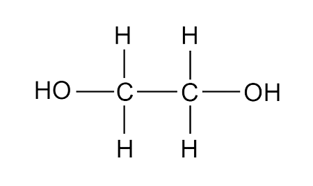

# Organic Chemistry 2

**_02/28/23_**

[**Checklist**](https://docs.google.com/document/d/1s7XQApie9tDC4XctesbvDdoKmbT79s5Tl31uphrp7I/edit)

## Functional Groups

> **Functional Group:** One or more atom in a molecule which determines its properties and behaviour

### Alcohols

Alcohols are part of the functional group OH, meaning all of them have an OH. They look like an alkane, but one of the hydrogens is replaced by an OH.

_Ethanol_

**Uses**

- Drinks
- Perfume
- Fuel

### Carboxylic Acids

Carboxylic acids are part of the functional group COOH. They look like an alcohol, but two of the hydrogens is replaced by an oxygen with a double bound.

_Ethanoic Acid_

**Uses**

- Aspirin
- Vinegar
- Can be used to make esters

### Esters

Esters are the product of an alcohol and a carboxylic acid. They look like the alcohol and carboxylic acid joined at the O, with an H2O removed. The carbon and two oxygens it is bonded to is called the ester link, which is its functional group (COO).

_Ethyl Ethanoate_

**Uses**

- Toiletries
- Perfumes
- Food flavourings

**Naming esters**

1. Change the name of the parent alcohol to end in –yl
2. Change the name of the parent acid to end in –oate
3. Alcohol name goes to the front, acid name to the back

Eg. Propanol + Ethanoic Acid -> Propyl Ethanoate + Water

### Diols

Diols are part of the functional group 2OH. They look like an alcohol but with an OH on both sides.

_Ethylene Glycol_

**Uses**

- Antifreeze products
- Food and medicinal industry
- Can be used to make polymers

### Dicarboxylic Acids

Dicarboxylic acids are part of the functional group 2COOH. They look like an carboxylic acid with a COOH on both sides.

**Uses**

- Used in the creation of nylon
- Can create polymers

## Polyesters

Polyesters are the combination of a dicarboxylic acid and a diol. They look like a dicarboxylic acid joined with a diol but with 2 H2Os removed. They are infinitely repeating and joined by an ester link
